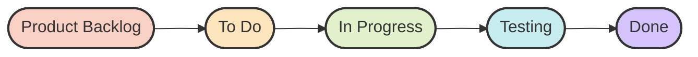

# Task #04 – Agile Development Models

**Product Name:** SpiderVision Intelligence – Social Media Threat Intelligence Platform

**Product Description:**
SpiderVision Intelligence is a cybersecurity platform that helps users collect Open Source Intelligence (OSINT), analyze social media profiles, identify suspicious activities, detect fake accounts, and generate intelligence reports.

> **Note:** As previously established, automated scripts cannot create or publish interactive Lucidchart documents. Therefore, a highly detailed **Agile Kanban Board** has been implemented natively here on GitHub using Markdown tables and Mermaid.js for an integrated visual experience.

---

## Agile Workflow Map

---

## Agile Kanban Board

| 📋 Product Backlog (Development) | 📝 To Do (Design) | ⚙️ In Progress (Marketing) | 🧪 Testing (QA) | ✅ Done (Deployment) |
| :--- | :--- | :--- | :--- | :--- |
| **Develop OSINT module:** Build the core data collection engine. | **Dashboard UI:** Design the primary interface. | **Launch Strategy:** Create a product launch strategy. | **Functional Tests:** Ensure all features work. | **Cloud Deployment:** Hosted securely on AWS. |
| **Profile Analyzer:** Implement social media parsing. | **Wireframes:** Create user journey paths. | **Promo Content:** Design promotional graphics. | **Security Tests:** Vulnerability and penetration tests. | **Domain Config:** Set up DNS and SSL. |
| **Threat Engine:** Build threat detection algorithms. | **Workflow Screens:** Design the investigation steps. | **Social Campaigns:** Prepare ad content. | **Performance Tests:** Load testing and scaling. | **Production Release:** Live to initial users. |
| **Report Generator:** Automated PDF/Intelligence reports. | **Responsive UI:** Mobile & desktop ready views. | **GitHub Publish:** Update portfolio & repository info. | **Bug Fixing:** Resolve identified issues. | **Maintenance:** Ongoing system monitoring. |
| **API Integration:** Connect backend databases. | **Accessibility:** Improve overall user experience. | **User Feedback:** Gather early testimonials. | | |
| **Authentication:** Secure user account management. | | | | |

---

### Attached Files
A Word document containing all Agile planning details, benefits, and student information has been successfully generated and placed in this directory: `Agile Development Models.docx`.
